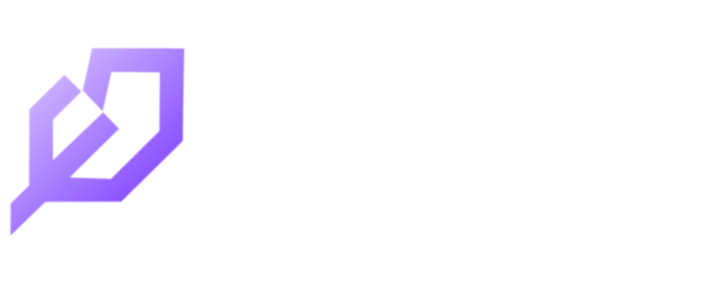

**Track your bounties. Know your worth. Get paid.**

A mobile-first bounty tracker for freelancers who live on Hackathons, Web3 Airdrops, Design Contests, and gig platforms — built for people who work entirely from their phone.

---

## 📲 Download

| Source | Link |
|---|---|
| **GitHub Releases** (recommended) | [Latest Release](https://github.com/limalime/garap/releases/latest) |
| **APKPure** | [Garap on APKPure](#) |

> Garap is currently in **beta preview**. Expect occasional rough edges — see [Known Issues](#-known-issues) below.

---

## 📸 Screenshots

---

## ✨ What is Garap?

If you find work through X, Medium, Discord, or wherever bounties get posted — and you're tired of Notion getting slower every month or losing track of deadlines in a notebook — Garap is built specifically for that workflow.

- **Track every bounty** — name, platform, deadline, prize, status, category, submission link, source link, and notes, all in one place
- **See your real earnings** — prizes in ETH, SOL, BTC, USDC, USDT, or IDR are automatically converted to USD so your revenue dashboard always reflects what you actually earned
- **Never miss a deadline** — calendar sync, countdown timers down to the hour, and reminders before things are due
- **Built for one-handed, phone-only use** — no desktop required, ever

---

## 🧩 Core Features

- **Dashboard** — total revenue (synced to USD), earnings chart, quick stats, recent bounties
- **Projects** — full bounty list with search, status filters, category filters, swipe actions
- **Notes** — freeform notes, optionally linked to a specific bounty
- **Calendar** — month view of deadlines, color-coded by urgency, with device calendar sync and reminders
- **Settings** *(hidden, accessible via the top-bar icon only)* — profile, theme, language (EN/ID), notification controls, data export (CSV/JSON), account management

### Authentication
Sign in with **Email**, **Google**, or **GitHub**.

### Multi-Currency Support
Prizes can be logged in **USDC, ETH, BTC, USD, IDR, SOL, or USDT**. When a bounty is marked **Won**, its value is automatically converted to USD using live exchange rates and added to your revenue total.

---

## 🛠️ Tech Stack

| Layer | Technology |
|---|---|
| Framework | [Expo](https://expo.dev) / React Native |
| Navigation | Expo Router (file-based) |
| State | Zustand |
| Backend | Supabase (Auth, Database, Storage, Realtime) |
| Styling | NativeWind (Tailwind CSS for React Native) |
| Charts | Victory Native |
| Animations | Lottie |

---

## 🚧 Project Status

Garap is **actively developed** and currently in **beta preview**. Core flows (auth, bounty tracking, revenue sync, calendar, settings) are functional and have been tested on physical Android devices via EAS development builds.

### Known Issues
This release may include a small number of known issues currently being addressed. If you run into something that isn't already tracked, please [open an issue](https://github.com/limalime/garap/issues) — bug reports are genuinely welcome.

---

## 📍 TODO

- [ ] iOS support
- [ ] Release on Google Play store & Apple App store
- [ ] Share view apps
- [ ] Instant bounty research via AI/Manual
- [ ] Bounty analytics & win-rate insights by category/platform
- [ ] Bounty templates for recurring submission types
- [ ] Optional team/collaboration mode
- [ ] Tax/earnings report export
- [ ] Integrate with crypto wallet

---

## 🤝 Contributing

Issues and pull requests are welcome. If you're planning a larger change, please open an issue first to discuss it before submitting a PR.

1. Fork the repo
2. Create a branch (`git checkout -b feature/your-feature`)
3. Commit your changes
4. Open a pull request

---

## 📄 License

Garap is licensed under the **MIT License**.
See [LICENSE](LICENSE) for the full text.

---

## 🙏 Acknowledgements

Built solo for freelancers who work the same way.

If Garap saves you time, consider [buying me a coffee](https://buymeacoffee.com/garap) ☕

